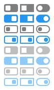
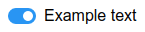

# input-switch

[](https://www.npmjs.com/package/input-switch)
[](https://www.npmjs.com/package/input-switch)
[](https://www.npmjs.com/package/input-switch)
[](https://paypal.me/oliverfindl)

Simple CSS for display checkbox and radio inputs as switch buttons.

> Inspired by [W3Schools](https://www.w3schools.com/) [example](https://www.w3schools.com/howto/howto_css_switch.asp).

---

## Example



## Install

Via [npm](https://npmjs.com/) [[package](https://www.npmjs.com/package/input-switch)]:
```bash
$ npm install input-switch
```

Via [yarn](https://yarnpkg.com/en/) [[package](https://yarnpkg.com/en/package/input-switch)]:
```bash
$ yarn add input-switch
```

From [unpkg](https://unpkg.com/):
```html
<link rel="stylesheet" href="//unpkg.com/input-switch" />
```

From [jsDelivr](https://jsdelivr.com/) [[package](https://www.jsdelivr.com/package/npm/input-switch)]:
```html
<link rel="stylesheet" href="//cdn.jsdelivr.net/npm/input-switch" />
```

### Notice

If you installed via package manager, don't forget to import CSS into your project.

## Usage

```html
<label class="has-switch">
	<input type="checkbox" />
	<span class="switch is-round"></span>
	Example text
</label>
```



## Modifiers

- `.has-switch`**`.has-half-space-after`** - space after switch is half sized

- `.has-switch`**`.has-no-space-after`** - space after switch is omitted

- `.switch`**`.is-square`** - switch is square shaped

- `.switch`**`.is-round`** - switch is round shaped

- `.switch`**`.is-outline`** - switch is outlined, can be combined with `.is-square` or `.is-round`


## Customization

It's possible to customize some variables, for example colors:
```scss
@charset "utf-8";

$switch-primary-color: #5ac65a;
$switch-secondary-color: #ff7157;

@import "../node_modules/input-switch/src/input-switch.scss";
```

Default values for all customizable variables:
```scss
/* sizes */
$switch-height: 1em; // default height of switch
$switch-width: $switch-height * 1.75; // default width of switch
$switch-space-after: $switch-height * .5; // default space after switch

/* colors */
$switch-primary-color: #2196f3; // default primary color of switch
$switch-secondary-color: grey; // default secondary color of switch
$switch-pointer-color: white; // default pointer color of switch
$switch-transparent-color: transparent; // default transparent color of switch

/* transitions */
$switch-transition-duration: .5s; // default transition duration of switch
$switch-transition-timing-function: ease; // default transition timing function of switch
```

---

## License

[MIT](http://opensource.org/licenses/MIT)
